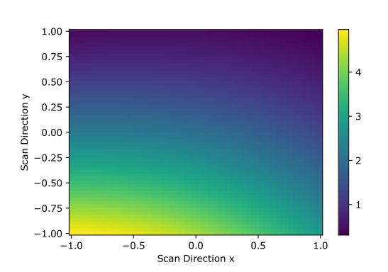

# orqviz

A Python package for easily **visualizing the loss landscape** of Variational Quantum Algorithms by [Zapata Computing Inc](https://www.zapatacomputing.com/).

`orqviz` provides a collection of tools which quantum researchs and enthusiasts alike can use for their simulations. It works with any framework for running quantum circuits, for example `qiskit`, `cirq`, `pennylane`, and `Orquestra`. The package contains functions to generate data, as well as a range of flexible plotting and helper functions. `orqviz` is light-weight and has very few dependencies.

## Getting started

In [doc/examples/](https://github.com/zapatacomputing/orqviz/tree/main/docs/examples) we provide a range of `Jupyter notebook` examples for `orqviz`. We have four Jupyter notebooks with tutorials for how to get started with any quantum circuit simulation framework you might use. You will find examples with `qiskit`, `cirq`, `pennylane` and Zapata's `Orquestra` library. The tutorials are not exhaustive, but they do provide a full story that you can follow along.

In [this notebook](https://github.com/zapatacomputing/orqviz/blob/main/docs/examples/sombrero.ipynb) we have the _Sombrero_ example that we showcase in our paper. We also have an [advanced example notebook](https://github.com/zapatacomputing/orqviz/blob/main/docs/examples/example_notebook.ipynb) which provides a thorough demonstration of the flexibility of the `orqviz` package.

We have recently published a paper on arXiv where we review the tools available with `orqviz`. TODO: Link to arXiv.

## Installation

You can install our package using the following command:

```bash
pip install orqviz
```

Alternatively you can build the package from source. This is especially helpful if you would like to contribute to `orqviz`

```bash
git clone https://github.com/zapatacomputing/orqviz.git
cd orqviz
pip install -e ./
```

## Examples

```python
import orqviz
import numpy as np

np.random.seed(42)

def loss_function(pars):
    return np.sum(np.cos(pars))**2 + np.sum(np.sin(30*pars))**2

n_params = 42
params = np.random.uniform(-np.pi, np.pi, size=n_params)
dir1 = orqviz.geometric.get_random_normal_vector(n_params)
dir2 = orqviz.geometric.get_random_orthonormal_vector(dir1)

scan2D_result = orqviz.scans.perform_2D_scan(params, loss_function,
                                direction_x=dir1, direction_y=dir2,
                                n_steps_x=100)
orqviz.scans.plot_2D_scan_result(scan2D_result)
```

This code results in the following plot:



## Authors

The leading developer of this package is Manuel Rudolph at Zapata Computing.\
For questions related to the visualization techniques, contact Manuel via manuel.rudolph@zapatacomputing.com .

The leading software developer of this package is Michał Stęchły at Zapata Computing.\
For questions related to technicalities of the package, contact Michał via michal.stechly@zapatacomputing.com .

You can also contact us or ask general questions using [GitHub Discussions](https://github.com/zapatacomputing/orqviz/discussions).

For more specific code issues, bug fixes, etc. please open a [GitHub issue](https://github.com/zapatacomputing/orqviz/issues) in the `orqviz` repository.

If you are doing research using `orqviz`, please cite our paper:

TODO

Thank you to Sukin Sim and Luis Serrano from Zapata Computing for their contributions to the tutorials.

## How to contribute

Please see our [Contribution Guidelines](docs/CONTRIBUTING.md).
